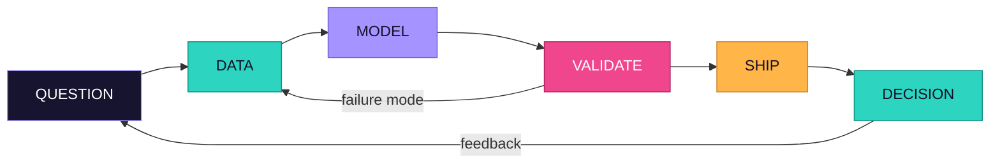
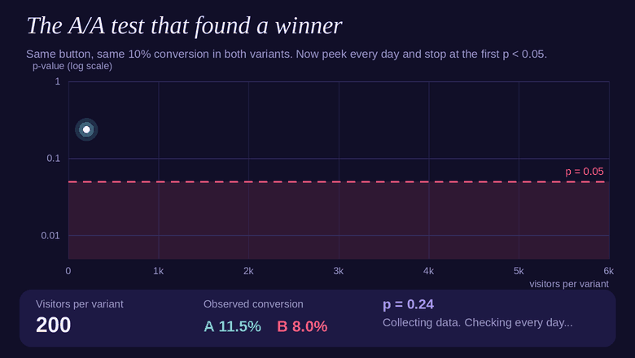

<!--
╔══════════════════════════════════════════════════════════════════╗
║  VINEETA KHANNA — GitHub Profile README                          ║
║  Built as a technical portfolio, not a résumé duplicate.         ║
╚══════════════════════════════════════════════════════════════════╝
-->

<div align="center">



*I turn messy data into intelligent systems — then make the evidence impossible to ignore.*

<sub>Machine Learning · GenAI · NLP · Data Engineering · Explainability · Experimentation · Decision Intelligence</sub>

<br><br>

<a href="mailto:vineeta2001khanna@gmail.com"></a>


## 01 / Model card — not the usual "about me"

ML teams document models before deployment. I borrowed the idea for myself: what I take in, what I produce, where I perform best, and how I validate the result.

| Field | Details |
|---|---|
| **Model** | Vineeta Khanna v2026 — Data Scientist × AI/ML Engineer × Applied Researcher |
| **Primary inputs** | Messy datasets · research questions · ambiguous product/business problems · unstructured text |
| **Core engine** | Statistical reasoning + machine learning + engineering + business context |
| **Outputs** | Reproducible pipelines · predictive models · GenAI systems · APIs/apps · dashboards · decision-ready insights |
| **Best operating conditions** | Problems where accuracy matters and someone eventually has to use the result |
| **Validation protocol** | Holdout data · external validation · calibration · explainability · error analysis · sanity checks |
| **Default question** | *"What decision changes if this model is right?"* |
| **Known quirk** | Cannot look at a single aggregate metric without wondering what the segments are hiding |

<div align="center">

**research → model → validate → explain → ship**

</div>




## 02 / Selected builds

<sub>Not a project dump. These are the systems that best show how I think.</sub>

### 🧪 BitterPredict — Can a molecule tell us whether it will taste bitter?

<table>
<tr>
<td width="64%" valign="top">

An end-to-end molecular machine-learning system that predicts bitterness from chemical structure. I combined interpretable molecular descriptors with Morgan fingerprints, benchmarked multiple model families, calibrated probabilities, added SHAP explanations, and built an applicability-domain layer so the system can say when a prediction should not be trusted.

**Pipeline**
`SMILES → RDKit → descriptors + fingerprints → XGBoost → calibration → SHAP → confidence / OOD → app`

**What makes it different**
Prediction is only one layer. The project also asks: how certain is the model, why did it decide that, has it seen chemistry like this before, and can a scientist actually use it.

`Python` `RDKit` `XGBoost` `SHAP` `scikit-learn` `FastAPI` `Gradio`

</td>
<td width="36%" valign="top">

**8,008**<br>curated compounds

**2,056**<br>molecular features

**0.9455**<br>holdout ROC-AUC

**~0.34 ms**<br>prediction latency / compound

</td>
</tr>
</table>

*Research lens: benchmarking, calibration, applicability domain, external validation, explainability and deployment — not just a leaderboard score.*

### 🏫 Home Eye — Search for a school like a parent, not like a spreadsheet

<table>
<tr>
<td width="64%" valign="top">

An AI-powered school intelligence and recommendation system that combines structured school information with unstructured parent reviews. The system uses semantic embeddings, sentiment analysis, ranking models and retrieval-augmented generation to turn fragmented information into conversational recommendations.

**System idea**
`school data + parent reviews → embeddings / sentiment → ranking → RAG → conversational recommendation`

`SBERT` `VADER` `LightGBM` `RAG` `LLMs` `NLP` `Python`

</td>
<td width="36%" valign="top">

**94%**<br>sentiment classification accuracy

**4 AI layers**<br>semantic search · sentiment · ranking · RAG

**1 interface**<br>from search to explanation

</td>
</tr>
</table>

*Design principle: recommendations should explain why something fits — not hide behind a score.*

### 🩺 Harmony Health AI — Replace a binary answer with a richer risk signal

<table>
<tr>
<td width="64%" valign="top">

A multimodal healthcare analytics concept integrating image signals, symptoms and longitudinal cycle history to support earlier PCOS/PCOD risk awareness. Rather than reducing a complex health pattern to a yes/no label, the system was designed around a continuous risk representation and interpretable user-facing insights.

**Multimodal view**
`visual signal + symptoms + temporal history → feature fusion → ML risk model → interpretable risk output`

`Computer Vision` `Machine Learning` `Temporal Analytics` `Python` `FastAPI`

</td>
<td width="36%" valign="top">

**87%**<br>classification accuracy

**3 modalities**<br>visual · symptom · temporal

**Continuous**<br>risk-oriented output

</td>
</tr>
</table>

*Product lens: build AI that communicates uncertainty and supports awareness rather than pretending a model is a diagnosis.*

### 📚 FoodProt Research Intelligence — What if literature review behaved like a data pipeline?

A research-intelligence workflow for discovering, validating and organizing food-protein literature at scale. The pipeline expands targeted queries, resolves metadata, follows open-access routes, validates PDFs, and prepares papers for structured AI-assisted extraction.

```
Protein + functionality keywords
            ↓
   scholarly search sources
            ↓
  metadata / DOI normalization
            ↓
  OA resolution & PDF validation
            ↓
  deduplication + relevance layer
            ↓
  structured extraction / knowledge base
```

`PubMed` `OpenAlex` `Semantic Scholar` `CORE` `Unpaywall` `Selenium` `PDF parsing` `LLM extraction`

*Engineering lesson: when a pipeline touches the open web, reliability, provenance and failure recovery matter as much as the model.*


## 03 / The stack — mapped to what I use it for


<table>
<tr>
<td width="25%" valign="top">

**MODEL**<br>
Python<br>
scikit-learn<br>
XGBoost<br>
LightGBM<br>
TensorFlow<br>
PyTorch<br>
NLP<br>
LLMs<br>
SHAP

</td>
<td width="25%" valign="top">

**DATA**<br>
SQL<br>
PostgreSQL<br>
MySQL<br>
BigQuery<br>
Pandas<br>
NumPy<br>
Spark<br>
PySpark<br>
Databricks

</td>
<td width="25%" valign="top">

**SHIP**<br>
FastAPI<br>
Flask<br>
Streamlit<br>
Gradio<br>
Docker<br>
Git / GitHub<br>
Airflow<br>
Kafka

</td>
<td width="25%" valign="top">

**CLOUD + DECIDE**<br>
AWS<br>
GCP<br>
Azure<br>
Tableau<br>
Power BI<br>
A/B testing<br>
Statistical modeling<br>
Experiment design

</td>
</tr>
</table>


## 04 / Data science lab

<sub>Small experiments I keep because "I know statistics" is less convincing than showing the failure mode live.</sub>

### 🎰 Experiment 01 — Peeking turns an A/A test into a slot machine

<div align="center">

</div>

Two variants. Same true conversion rate: 10%. No real winner exists.

I ran 2,000 simulations. Checking every 25 visitors and stopping at the first p < 0.05 declared a fake winner **34.4%** of the time. Looking once at the planned sample size produced **4.9%** false positives.

**Takeaway:** a p-value is not a progress bar. Experimental design comes before the dashboard.

[`reproduce the simulation →`](experiments/peeking_simulation.py)

### 🧠 Experiment 02 — The aggregate can be correct and still mislead you



Simpson's paradox is one of my favorite reminders that the question "what happened?" is often easier than "why did it happen?"

<details>
<summary><b>Open the classic kidney-stone example</b></summary>

<br>

| Success rate | Treatment A | Treatment B |
|---|---|---|
| Small stones | 93% (81/87) | 87% (234/270) |
| Large stones | 73% (192/263) | 69% (55/80) |
| **Overall** | **78% (273/350)** | **83% (289/350)** |

A performs better within both severity groups, while B looks better in aggregate because the treatments were used on different mixes of easy and difficult cases.

**Takeaway:** before interpreting an aggregate KPI, inspect assignment, segments, confounding and denominator shifts.

</details>


## 05 / Research DNA

I like projects that sit between science and engineering — where the data is imperfect, the ground truth is expensive, and model performance alone does not settle the question.

```
                 ┌──────────────────┐
                 │  APPLIED AI / ML │
                 └────────┬─────────┘
                          │
          ┌───────────────┼───────────────┐
          │               │               │
          ▼               ▼               ▼
   Scientific ML     GenAI / NLP     Decision Science
   molecules · VOCs   RAG · LLMs      experiments · BI
          │               │               │
          └───────────────┼───────────────┘
                          ▼
                 usable systems
```

Themes I keep returning to: explainability · uncertainty · multimodal learning · research automation · responsible AI · causal thinking · real-world deployment.


## 06 / Education + signals

<table>
<tr>
<td width="55%" valign="top">

**🎓 Education**

**M.S. Computational Science — Data Science**<br>
San Diego State University<br>
Machine Learning · Statistical Modeling · AI · Deep Learning · Cloud Computing

**Post Graduate Diploma — Computer Science & Applications**<br>
SNDT Mumbai University<br>
🥇 Gold Medalist · First Rank

**B.S. Applied Statistics & Data Analytics**<br>
NMIMS<br>
🥇 Gold Medalist · First Rank

</td>
<td width="45%" valign="top">

**✦ Recognition**

Mintz Entrepreneurship Award<br>
Applied AI innovation · Research + product mindset

I enjoy work where an idea has to survive both methodological scrutiny and a real user.

**Current direction**<br>
Production AI · ML systems · data engineering · intelligent analytics

</td>
</tr>
</table>


<div align="center">

## 07 / If you made it this far...

the posterior probability of us having something useful to discuss just went up.

$$
P(\text{call} \mid \text{README}) \;\propto\; P(\text{README} \mid \text{call}) \cdot P(\text{call})
$$

Here, "call" means a conversation about a role. I'm interested in teams working on Data Science, AI/ML Engineering, Applied AI, Data Engineering, and intelligent analytics systems.

<a href="mailto:vineeta2001khanna@gmail.com"></a>

<br><br>

<sub>Built like a model card. Evaluated like a system. Still learning like a researcher.</sub>

</div>

<!--
OPTIONAL LINKS TO ADD ONCE YOU HAVE THE EXACT URLS:
LinkedIn | Portfolio | Resume | BitterPredict repo/demo | Home Eye repo/demo | Harmony Health repo/demo
Do not add placeholder links publicly. Real links only.
-->
